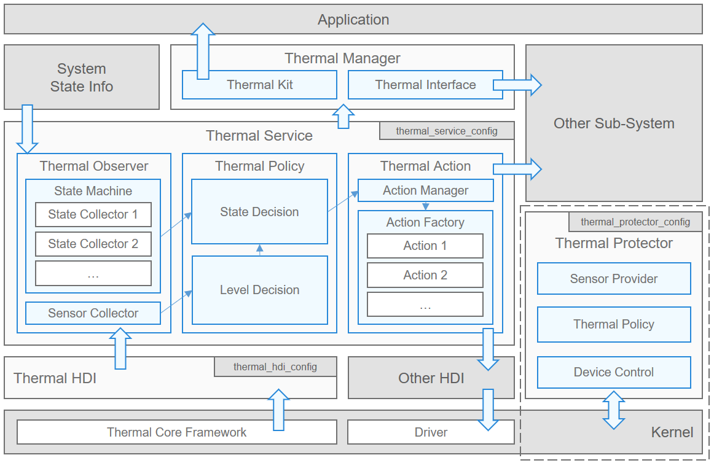

# 热管理服务

-   [简介](#section0056945901)
-   [目录](#section0056945902)
-   [配置说明](#section0056945903)
-   [相关仓](#section0056945904)

## 简介<a name="section0056945901"></a>

热管理服务提供设备温度管理控制能力，保障整机热安全及热体验。

**图 1**  热管理服务架构图 


**热管理服务模块功能说明**：

1. 温控管理中心（Thermal Manager）：提供对应用及其他子系统的温控查询及回调接口。
2. 温控核心服务（Thermal Service）：提供温度检测、档位仲裁及动作下发等温控核心功能，附配置文件。
3. 内核连接模块（Thermal HDI）：提供温度驱动信息上报及驱动指令下发等功能，附配置文件。
4. 非运行态温控模块（Thermal Protector）：提供非运行态时的简化温控服务，附配置文件。

## 目录<a name="section0056945902"></a>
```
/base/powermgr/thermal_manager
├── application                  # native应用
│   └── protector                # Thermal Protector代码
├── etc                          # init配置
├── figures                      # 图片
├── frameworks                   # napi接口
├── hdi                          # Thermal HDI代码
│   ├── api                      # api接口
│   ├── client                   # 客户端代码
│   └── service                  # 服务代码
├── interface                    # 接口
│   ├── innerkits                # 内部接口
│   └── kits                     # 外部接口
├── sa_profile                   # SA配置文件
├── services                     # Thermal Service代码
│   ├── native                   # native层
│   ├── test                     # 单元测试代码
│   └── zidl                     # zidl层
├── test                         # 测试代码
└── utils                        # 工具和通用层
```

## 配置说明<a name="section0056945903"></a>
**thermal_service_config.xml**
配置示例：

```
<?xml version="1.0" encoding="UTF-8"?>
<thermal version="0.99" product="ipx">
    <base>
        <item tag="temperature_query_enum" value="soc,battery,shell,ambient"/>
    </base>
    <level>
        <sensor_cluster name="warm_base" sensor="shell">
            <item level="1" threshold="35000" threshold_clr="33000"/>
            <item level="2" threshold="37000" threshold_clr="35000"/>
            <item level="3" threshold="40000" threshold_clr="38000"/>
        </sensor_cluster>
        <sensor_cluster name="warm_safe" sensor="battery,pa">
            <item level="1" threshold="48000,60000" threshold_clr="45000,55000"/>
        </sensor_cluster>
    </level>
    <state>
        <item name="screen"/>
        <item name="charge"/>
    </state>
    <action>
        <item name="cpu"/>
        <item name="current"/>
        <item name="shut_down" param="100"/>
        <item name="thermal_level" strict="1"/>
    </action>
    <policy>
        <config name="warm_base" level="1">
            <cpu screen="1">2800000</cpu>
            <cpu screen="0">2400000</cpu>
            <current charge="1">1500</current>
            <thermal_level>3</thermal_level>
        </config>
        <config name="warm_base" level="2">
            <cpu screen="1">2200000</cpu>
            <cpu screen="0">1800000</cpu>
            <current charge="1">1200</current>
            <thermal_level>4</thermal_level>
        </config>
        <config name="warm_base" level="3">
            <cpu screen="1">1600000</cpu>
            <cpu screen="0">1200000</cpu>
            <current charge="1">1000</current>
            <thermal_level>5</thermal_level>
        </config>
        <config name="warm_safe" level="1">
            <shut_down>1</shut_down>
        </config>
    </policy>
</thermal>
```
```
thermal                          # 根目录，version为版本号；product为产品名
├── base                         # base目录，配置基本参数
│   └── item                     # item目录，tag为配置标签，value为配置值
├── level                        # level目录，配置温度档位信息
│   └── sensor_cluster           # sensor_cluster目录，表示一个sensor集合，name为集合名，sensor为传感器名
│       └── item                 # item目录，配置具体档位信息，level为等级，threshold为触发温度，xxx_clr为回退温度
├── state                        # state目录，配置状态机，name为状态机名称
├── action                       # action目录，配置动作，name为加载动作名称，param为加载参数，strict为仲裁方案
└── policy                       # policy目录，配置档位对应的动作
    └── config                   # config目录，配置对应档位的动作，name对应sensor_cluster的name，level对应其item中的level
        └── <action_name>        # 标签值对应动作的动作值，属性中可以配置state条件及对应的值
```

**2）thermal_hdi_config.xml**
配置示例：

```
<?xml version="1.0" encoding="UTF-8"?>
<thermal version="0.99" product="ipx">
    <base>
        <item tag="xxx" value="3"/>
    </base>
    <polling>
        <group name="v1" interval="5000">
            <thermal_zone type="skin" replace="shell"/>
            <thermal_zone type="soc"/>
            <thermal_node type="charger" path="/sys/module/thermal/param/chg_thermal"/>
            <thermal_zone type="battery"/>
        </group>
    </polling>
</thermal>
```
目录说明：
```
thermal                          # 根目录，version为版本号；product为产品名
├── base                         # base目录，配置基本参数
│   └── item                     # item目录，tag为配置标签，value为配置值；
└── polling                      # polling目录，配置温度上报信息
    └── group                    # group目录，配置上报组，name为组名，interval为轮询上报周期，单位ms
        ├── thermal_zone         # thermal_zone目录，配置thermal zone上报，type对应该驱动的type，replace（可选）为替换的type名
        └── thermal_node         # thermal_node目录，配置驱动节点上报，path为节点路径
```

**3）thermal_protector_config.xml**
配置示例：

```
<?xml version="1.0" encoding="utf-8"?>
<thermal version="0.99" product="ipx">
    <base>
        <item tag="xxx" value="3"/>
    </base>
    <control>
        <thermal_zone type="battery" interval="5000">
            <item level="1" threshold="37000" threshold_clr="35000">
                <current>1800</current>
            </item>
            <item level="2" threshold="40000" threshold_clr="38000">
                <current>1500</current>
                <voltage>5</voltage>
            </item>
        </thermal_zone>
    </control>
</thermal>

```
目录说明：
```
thermal                          # 根目录，version为版本号；product为产品名
├── base                         # base目录，配置基本参数
│   └── item                     # item目录，tag为配置标签，value为配置值；
└── control                      # control，配置温度档位及动作
    └── thermal_zone             # thermal_zone目录，type为对应类型，interval为轮询上报周期，单位ms
        └── item                 # item目录，配置具体档位信息，level为等级，threshold为触发温度，xxx_clr为回退温度
            └── <action_name>    # 标签值对应动作的动作值
```

## 相关仓<a name="section0056945904"></a>
[电源管理子系统](https://gitee.com/openharmony/docs/blob/master/zh-cn/readme/%E7%94%B5%E6%BA%90%E7%AE%A1%E7%90%86%E5%AD%90%E7%B3%BB%E7%BB%9F.md)

[powermgr_power_manager](https://gitee.com/openharmony/powermgr_power_manager)

[powermgr_display_manager](https://gitee.com/openharmony/powermgr_display_manager)

[powermgr_battery_manager](https://gitee.com/openharmony/powermgr_battery_manager)

**powermgr_thermal_manager**

[powermgr_battery_statistics](https://gitee.com/openharmony/powermgr_battery_statistics)

[powermgr_battery_lite](https://gitee.com/openharmony/powermgr_battery_lite)

[powermgr_powermgr_lite](https://gitee.com/openharmony/powermgr_powermgr_lite)
